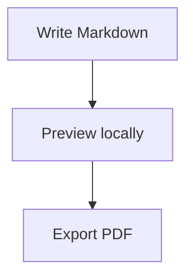

# Easy Mark

Easy Mark is a command-line tool for turning a folder of Markdown files into a clean local documentation site, then exporting the same content to PDF when you need a shareable document.

It is designed for project notes, product docs, team handbooks, technical guides, and any content set where Markdown must become something easy to browse.

## What It Does

- **Serves Markdown as a website:** point Easy Mark at a directory and it opens the content through a local single-page app.
- **Builds navigation automatically:** nested Markdown files become a structured menu.
- **Keeps output clean:** rendered HTML is sanitised before it is shown.
- **Supports visuals:** Mermaid diagrams and Chart.js charts work directly from fenced Markdown blocks.
- **Exports to PDF:** create a complete PDF from the same Markdown source.
- **Works locally:** bundled assets are served from the package, without depending on external CDNs.

## Installation

Install it in a project:

```sh
npm install @easy-mark/cli
```

Then run it through `npx`:

```sh
npx easy-mark serve ./docs
```

Or install it globally if you want the `easy-mark` command available everywhere:

```sh
npm install --global @easy-mark/cli
```

## Quick Start

Create a folder with Markdown files:

```text
docs/
  README.md
  guides/
    setup.md
    release.md
```

Preview it locally:

```sh
easy-mark serve ./docs
```

Use a custom title:

```sh
easy-mark serve ./docs --title "Team Handbook"
```

Export it to PDF:

```sh
easy-mark export ./docs --pdf ./team-handbook.pdf
```

## Project Metadata

You can add an optional `manifest.json` file to the content directory:

```json
{
  "title": "Team Handbook",
  "logo": "/logo.svg"
}
```

The title is resolved in this order:

1. `manifest.json`
2. `--title`
3. `Easy Mark`

## Diagrams

Mermaid diagrams are supported with `mermaid` fences:

````md

````

## Charts

Charts are supported with JSON `chart` fences:

````md
```chart
{
  "type": "line",
  "title": "Pages reviewed",
  "data": {
    "labels": ["Mon", "Tue", "Wed", "Thu", "Fri"],
    "datasets": [
      {
        "label": "Pages",
        "data": [4, 7, 11, 13, 18]
      }
    ]
  }
}
```
````

Supported chart types are `bar`, `line`, `pie`, `doughnut`, `donut`, `polarArea`, `radar`, `bubble`, and `scatter`. `donut` is accepted as an alias for Chart.js `doughnut`.

## Demo

This repository includes a `demo/` directory with a Mermaid flowchart, a line chart, and a pie chart.

From a repository checkout, run:

```sh
node bin/easy-mark.mjs serve ./demo
```

After installing the package, the same content can be served with:

```sh
easy-mark serve ./demo
```

## Requirements

Easy Mark requires Node.js 22 or later.

PDF export requires a Playwright-compatible Chromium environment.
