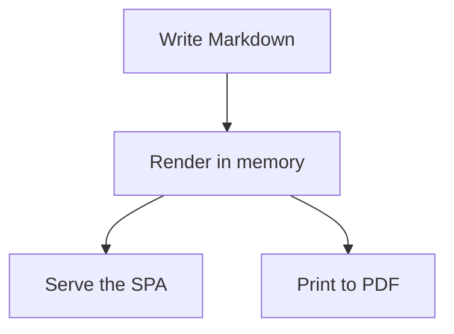

# Easy Mark

A lightweight CLI to compile, sanitise, preview, and export Markdown directories as production-ready HTML and PDFs.

## Key Features

- **Directory-driven:** Process entire nested Markdown structures without a project-specific `src/` convention.
- **Sanitised output:** Generate deterministic, secure HTML previews held in memory instead of writing compiled fragments to disk.
- **Built-in visuals:** Render Mermaid diagrams and Chart.js charts from Markdown fences by default.
- **PDF export:** Export the complete documentation set through the same sanitised rendering pipeline.
- **Local runtime:** Serve the bundled app shell, styles, fonts, icons, Mermaid, and Chart.js assets without CDNs.

`easy-mark` is published as `@easy-mark/cli` while keeping the terminal binary name `easy-mark`.

## Installation

Install the published package:

```sh
npm install @easy-mark/cli
```

The package exposes the `easy-mark` binary on `node_modules/.bin/` and, when installed globally, on your shell `PATH`.

## Usage

From a repository checkout, run the local binary against any content directory:

```sh
node bin/easy-mark.mjs serve ./demo
```

After installation, use the terminal binary directly:

```sh
easy-mark serve ./demo
easy-mark serve ./demo --title "Team Handbook"
easy-mark export ./demo --pdf ./handbook.pdf
```

`./demo` is a repository-only sample directory. Your own content directory can be anywhere and may contain Markdown files plus public assets. The `serve` command keeps generated HTML in memory, and `export` writes only the requested PDF file.

The visible project title uses this precedence: `manifest.json` in the content directory, then `--title`, then `Easy Mark`. A manifest is optional:

```json
{
  "title": "My documentation",
  "logo": "/logo.svg"
}
```

## Demo

The bundled demo at `./demo` shows the supported visual features working together:

- A Mermaid flowchart
- A Chart.js line chart
- A Chart.js pie chart

Open it locally with:

```sh
node bin/easy-mark.mjs serve ./demo
```

## Visual Examples

Mermaid diagrams are written as fenced Markdown blocks:

````md

````

Chart.js charts use JSON fenced blocks:

````md
```chart
{
  "type": "line",
  "title": "Documents rendered",
  "data": {
    "labels": ["Mon", "Tue", "Wed", "Thu", "Fri"],
    "datasets": [
      {
        "label": "Pages",
        "data": [4, 7, 11, 13, 18]
      }
    ]
  }
}
```

```chart
{
  "type": "pie",
  "title": "Content mix",
  "data": {
    "labels": ["Guides", "Notes", "Assets"],
    "datasets": [
      {
        "label": "Share",
        "data": [55, 30, 15]
      }
    ]
  }
}
```
````

The chart block accepts `bar`, `line`, `pie`, `doughnut`, `donut`, `polarArea`, `radar`, `bubble`, and `scatter`. `donut` is a friendly alias for Chart.js `doughnut`. Chart configuration must be valid JSON, not JavaScript, so callbacks and custom plugins are not accepted.

## Repository Notes

`core/server/` contains the server and CLI logic, while `core/web/` contains the browser runtime, assets, and default templates. `core/web/index.template.html` and `core/web/styles.template.css` are always loaded into memory as `index.html` and `styles.css`; the content directory cannot replace them with its own `index.html` or `styles.css`.

The repository uses Conventional Commits and includes a versioned `commit-msg` hook. After cloning, install the dependencies and configure the local hook:

```sh
npm install
npm run hooks:install
```

The command is idempotent and sets `core.hooksPath=hooks` only in the Git configuration for the current clone. If the clone already uses a different hook path, the installer stops without overwriting it and requires an explicit decision. The format can also be checked manually:

```sh
npm run commit:validate -- --message "feat(navigation): add keyboard shortcuts"
```

Allowed types are `feat`, `fix`, `docs`, `chore`, `test`, `refactor`, `build`, and `ci`, with an optional scope. `!` and a strict `BREAKING CHANGE: description` or `BREAKING-CHANGE: description` footer can independently mark an incompatible change. The hook applies Git clean-up modes that can be determined without knowing the invocation: `strip` and `whitespace` are reproduced, `default` and `verbatim` preserve the input, while `scissors` applies only whitespace normalisation so text that Git might keep in non-edited commits is not accepted accidentally. `core.commentString` and `core.commentChar` respect the last effective configuration. Merge subjects are accepted only in known Git forms during a real merge. The hook can be bypassed with `--no-verify`, so it is not a server-side control.

The Codex `$generate-commit` skill analyses the status and staged diff to propose a semantic message. It does not create commits or stage files without an explicit request.

## Codex Multi-Agent Workflow

The directories whose names include `agents` have different responsibilities:

- `.agents/skills/` contains repository-scoped skills discovered by Codex. Each skill uses the required `SKILL.md` format and may include `agents/openai.yaml` metadata.
- `.codex/agents/` contains the TOML configuration for the project's subagent roles.

They must not be merged. Codex starts subagents only when explicitly requested; after configuration changes, use a new thread.

Narrow changes can be delegated to `implementer`; security, routing, sanitisation, virtual filesystems, concurrency, watchers, and architecture require `senior-implementer`.

## Workspace Scripts

Executable workflow and maintenance logic lives under `script/` and uses only ESM JavaScript with the `.mjs` extension. Skills, metadata, agent configurations, and guardrails remain Markdown, YAML, TOML, and Markdown respectively because they are declarative formats read directly by tools. `hooks/commit-msg` is the minimal POSIX wrapper required by Git's hook interface and delegates all logic to the `.mjs` validator.
