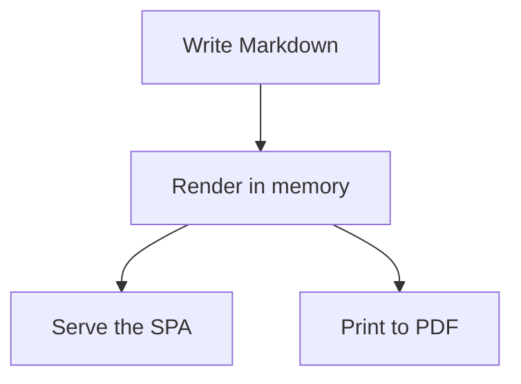

# Easy Mark Demo

This sample demonstrates the local Mermaid and Chart.js rendering pipeline that ships with the CLI.

## Flow



## Throughput

```chart
{
  "type": "line",
  "title": "Documents rendered per day",
  "data": {
    "labels": ["Mon", "Tue", "Wed", "Thu", "Fri"],
    "datasets": [
      {
        "label": "Pages",
        "data": [4, 7, 11, 13, 18],
        "borderColor": "#0b57d0",
        "backgroundColor": "rgba(11, 87, 208, 0.15)",
        "fill": true,
        "tension": 0.3
      }
    ]
  },
  "options": {
    "scales": {
      "y": {
        "beginAtZero": true,
        "ticks": {
          "precision": 0
        }
      }
    }
  }
}
```

## Content Mix

```chart
{
  "type": "pie",
  "title": "Content mix",
  "data": {
    "labels": ["Guides", "Notes", "Assets"],
    "datasets": [
      {
        "label": "Share",
        "data": [55, 30, 15],
        "backgroundColor": ["#0b57d0", "#1f7a8c", "#f4b400"]
      }
    ]
  }
}
```
